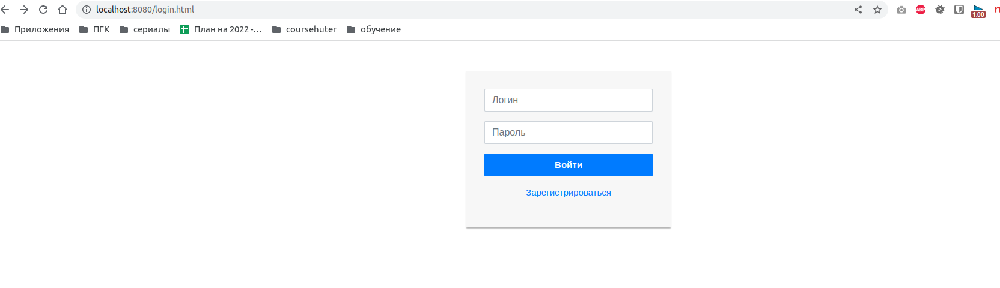
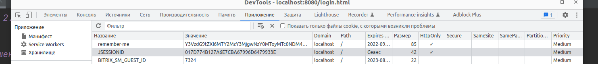
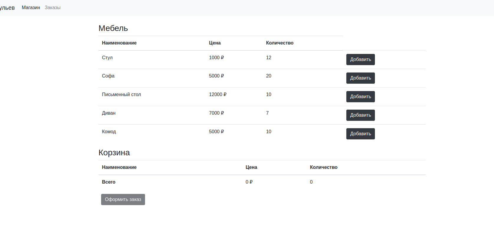
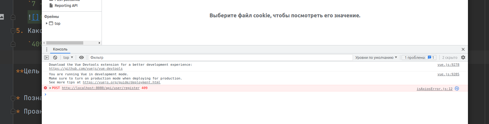

#### 2.6 Практическая работа

# Решение:

Если вы не знакомы с Java/Spring ответьте на следующие вопросы для сдачи этого домашнего задания:

1. В каком архитектурном стиле выполнено приложение?
   `Монолитное приложение - следуя названию и описанию на уроке и тому, что запукается только 1 сервис.`
2. На каком порту запускается приложение? - 8080
   `8080`
   
3. Напишите название cookie, которая выписывается клиенту при удачной аутентификации.
   `remember-me`
   
4. Укажите количество позиций “Диван”, доступных для продажи на старте приложения.
   `7 - customer`
   
5. Какой HTTP Status Code возвращается при попытке зарегистрировать уже существующего пользователя.
   `409`
   

**Цель домашнего задания**

* Познакомиться с приложением monolithic-app
* Проанализировать функционал, архитектуру и код решения

**Описание домашнего задания**

В качестве проверки, что студент выполнил задание студенту предстоит ответить на несколько контрольных вопросов. Вопросы делятся на две категории:

1. На анализ функционала и архитектуры, для тех кто не знаком с Java/Spring
2. Вопросы по коду для тех, кто знаком Java/Spring

Обязательным для сдачи ДЗ является ответы на первую категорию вопросов.

**Задание**

В этом модуле мы познакомились с монолитным приложением, разработанным для компании 12 стульев. Исходные код и документация к приложению находятся в приложенном архиве.

- 💡 Для запуска приложения можете использовать скомпилированный файл jar. [Для этого скачайте архив](https://drive.google.com/file/d/1JbZCB4RkFjSE0Dj-RfpB-tSnnYBMlN8m/view?usp=sharing), распакуйте и в терминале находясь в папке с jar файлом выполните:

```
java -jar monolithic-app-1.0.0.jar
```

Если вы не знакомы с Java/Spring ответьте на следующие вопросы для сдачи этого домашнего задания:

1. В каком архитектурном стиле выполнено приложение?
2. На каком порту запускается приложение?
3. Напишите название cookie, которая выписывается клиенту при удачной аутентификации.
4. Укажите количество позиций “Диван”, доступных для продажи на старте приложения.
5. Какой HTTP Status Code возвращается при попытке зарегистрировать уже существующего пользователя.

**Советы и рекомендации**

* Для ответа на некоторые вопросы может потребоваться инструмент разработчика в браузере. В большинстве популярных браузеров этот функционал доступен по нажатию F12

**Критерии оценки**

**«Зачёт»** — Вы прислали правильные ответы на 5 обязательных вопросов.

**«На доработку»** — выполнены не все обязательные пункты задания.
